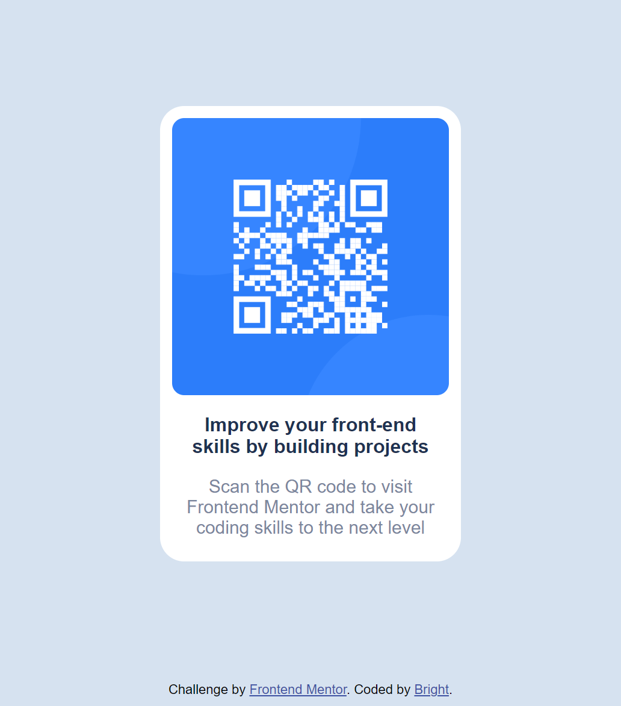

# Frontend Mentor - QR code component solution

This is a solution to the [QR code component challenge on Frontend Mentor](https://www.frontendmentor.io/challenges/qr-code-component-iux_sIO_H). Frontend Mentor challenges help you improve your coding skills by building realistic projects.

## Table of contents

- [Overview](#overview)
  - [Screenshot](#screenshot)
  - [Links](#links)
- [My process](#my-process)
  - [Built with](#built-with)
  - [What I learned](#what-i-learned)
  - [Continued development](#continued-development)
  - [Useful resources](#useful-resources)
- [Author](#author)
- [Acknowledgments](#acknowledgments)


## Overview

### Screenshot

)

- Solution URL: [Add solution URL here](https://your-solution-url.com)

### Built with

- Semantic HTML5 markup
- CSS custom properties
- Flexbox
- CSS Grid

### What I learned

I got a little lost and confused when it came to dimesions so i did a little bit of fiddling to get a closet match.

```html
<div class="card">
  <div class="container">
    <div class="card2">
      
    </div>
    <p class="text">Improve your front-end skills by building projects</p>
    <p class="text2">
      Scan the QR code to visit Frontend Mentor and take your coding skills to
      the next level
    </p>
  </div>
</div>
```

```css
.card {
  display: flex;
  height: 100vh;
  justify-content: center;
  align-items: center;
}


### Continued development

I think am going to spend a little more time relearning grids cause i fumbled on it mostly wheen building this
project

### Useful resources

- [Course i took](https://www.udemy.com/course/the-complete-web-development-bootcamp/) - This is the Full-stack web development course i took

## Author


- Frontend Mentor - [@yourusername](https://www.frontendmentor.io/profile/yourusername)
- Twitter - [@yourusername](https://www.twitter.com/imaginbright)


```
